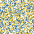

### Image Reconstruction with Genetic Algorithm

#### <b>ga_image_3_color.py</b> 

1. Takes <b>image/python-logo-50-50.png</b> and maps it's pixels to three integers {blue pixels: 0, yellow pixels: 1, white pixels: 2}. 
2. Flattens the categorized image from 50 x 50 to a 1D array of length 2500.  This is the target array.  
3. <b>N</b> agents are spawned where each agent has an array of <b>n</b> genes where <b>n</b> is the number of pixels in the target image.   
The first generation initializes all <b>N</b> agents with random values from {0, 1, 2}.
4. The fitness of each agent is then evaluated based on what percent of it's genes match the target image.   
5. The top <b>survival_fraction</b> fittest agents live on to the next generation and breed to replace the less fit agents. 
Breeding consists of randomly selecting 2 fit agents and creating 2 children by splicing together segments of the parent's genes. 
6. Then the children's <b>mutation_rate</b> of the children's genes are mutated (randomly set to 0, 1, or 2).   
This way if all of the parents have a certain gene that is bad, there is still a chance that the child could get a good value for that gene. 
7. The process of evaluating fitness, breeding, and mutating is then repeated resulting in a steady increase in the fitness of the average agent.  

#### <b>settings</b> 

<b>generations</b>: how many generations to run for, simulation automatically stops when a perfect agent is born 
<b>target</b>: the target image after converting blue -> 0, yellow -> 1, white -> 2 and flattening to 1D 
<b>population</b>: how many agents per population 
<b>save_file</b>: where to save the best agent from each generation 
<b>color_scheme</b>: mapping for the output colors color_scheme[int] -> List[red, green, blue] where red is a float between 0 and 1 
<b>survival_fraction</b>: the top survival_fraction &middot; population agents survive across generations and breed 
<b>mutation_rate</b>: starts at 100% then scales inversely with the fittest agent asymptotically approaching 0% 